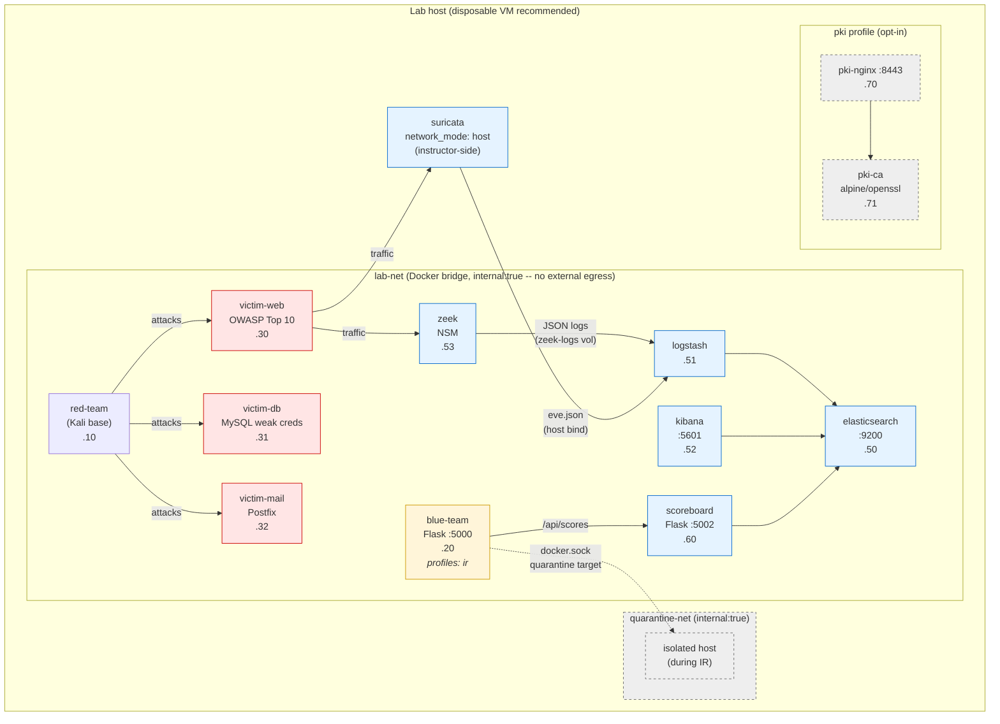

# Adversary-in-a-Box Lab

> Docker-based red/blue team lab for CompTIA Security+ (SY0-701): MITRE ATT&CK campaigns vs. an ELK/Zeek SIEM on an isolated network.

[](LICENSE)
[](https://docs.docker.com/compose/)
[](https://python.org)
[](https://www.comptia.org/certifications/security)

---

## Project Mission Statement

**Organization Type:** Fictional Enterprise / Managed Service Provider
**Security Challenge:** The organization is vulnerable to advanced persistent threats, including credential theft, lateral movement, and data exfiltration.
**Demonstration:** We will replicate a multi-tiered enterprise environment (web servers, databases, endpoints) and execute a full kill-chain attack (reconnaissance, initial access, privilege escalation, lateral movement, exfiltration).
**Defense:** We will protect the environment by deploying a centralized SIEM (ELK -- Elasticsearch + Logstash + Kibana), configuring network intrusion detection (Suricata + Zeek), and implementing incident response playbooks.
**Verification:** Effectiveness will be verified by running automated Red Team campaigns and validating that alerts are triggered in the SIEM and IR playbooks successfully block the attacks.

**Course Modules Integrated:**
- Module 2: Pervasive Attack Surfaces and Controls (Threats, Vulns & Mitigations)
- Module 5: Endpoint Vulnerabilities, Attacks, and Defenses
- Module 8: Infrastructure Threats and Security Monitoring

---

## Overview

**Adversary-in-a-Box** is a self-contained, Docker-based cybersecurity lab that lets you practice both sides of the attack/defend cycle. The red team runs scripted MITRE ATT&CK campaigns against a realistic target environment; the blue team deploys IDS rules, SIEM correlation logic, and automated incident response playbooks. A shared forensic dashboard scores both teams and generates after-action reports.

Designed as a hands-on companion to the *CompTIA Security+ Guide to Network Security Fundamentals* (Ciampa, 8th Ed.), every lab module maps explicitly to exam objectives.

---

## Security+ Domain Mapping

| Module | Domain 1 — Threats, Attacks & Vulnerabilities | Domain 2 — Security Operations | Domain 3 — Implementation |
|---|---|---|---|
| Red Team Campaigns | Phishing, malware, MITM, privesc | | Exploiting weak cipher configs |
| Blue Team Detection | Indicator of Compromise (IoC) analysis | SIEM correlation, IDS rules, log review | Network ACLs, firewall rules |
| PKI & Crypto Lab | | | Certificate management, TLS hardening |
| Incident Response | Threat classification | IR playbook execution, forensics | Evidence integrity via hashing |
| Forensic Dashboard | Threat actor TTPs (MITRE ATT&CK) | Alert triage, reporting | Secure audit log storage |

> **Scope.** Hands-on lab exercises implement **Domains 1–3**. Objective
> maps for **Domain 4 — Security Program Management** ([`docs/domain-4-objectives.md`](docs/domain-4-objectives.md))
> and **Domain 5 — Governance, Risk & Compliance** ([`docs/domain-5-objectives.md`](docs/domain-5-objectives.md))
> are provided and lean on the existing forensics/PKI tooling; they are
> not yet driven by dedicated campaigns.

---

## Architecture



### Profile / network gating

| Component | Profile | Network | Notes |
|---|---|---|---|
| All victims, ELK, scoreboard, Suricata, Zeek, red-team | default | `lab-net` | Always start. |
| `blue-team` (Flask + IR scripts) | `ir` | `lab-net` + `quarantine-net` | Gated -- has `/var/run/docker.sock` (audit-2 Gap #1). Default-enabled via `COMPOSE_PROFILES=ir` in `.env.example`. |
| `pki-nginx`, `pki-ca` | `pki` | `lab-net` | Opt-in: `docker compose --profile pki up`. |
| Quarantine target | (transient) | `quarantine-net` | A victim swapped here by `isolate_host.sh` during IR; restored by `restore_host.sh`. |

### Per-student isolation

`COMPOSE_PROJECT_NAME` + `LAB_NET_PREFIX` from `.env` prefix every
container + network name so multiple students share one host without
collisions. See `scripts/lab/student-env.sh` for the generator.

---

## Folder Structure

```
adversary-in-a-box/
│
├── README.md
├── LICENSE
├── docker-compose.yml            # Orchestrates all lab services
├── .env.example                  # Environment variable template
│
├── docs/
│   ├── setup-guide.md            # Installation walkthrough
│   ├── domain-1-objectives.md    # SY0-701 Domain 1 lab map
│   ├── domain-2-objectives.md    # SY0-701 Domain 2 lab map
│   ├── domain-3-objectives.md    # SY0-701 Domain 3 lab map
│   ├── mitre-attack-map.md       # ATT&CK technique index
│   └── after-action-template.md  # Incident report template
│
├── red-team/
│   ├── Dockerfile
│   ├── requirements.txt
│   ├── runner.py                 # CLI campaign launcher
│   │
│   ├── campaigns/
│   │   ├── base_campaign.py      # Abstract campaign class
│   │   ├── phishing/
│   │   │   ├── spear_phish.py    # T1566.001 — Spearphishing Attachment
│   │   │   └── payload_gen.py    # Generates test payloads (benign)
│   │   ├── initial_access/
│   │   │   ├── vuln_scan.py      # T1595 — Active Reconnaissance
│   │   │   └── exploit_web.py    # T1190 — Exploit Public-Facing App
│   │   ├── privilege_escalation/
│   │   │   ├── sudo_abuse.py     # T1548.003 — Sudo and Sudo Caching
│   │   │   └── suid_hunt.py      # T1548.001 — Setuid and Setgid
│   │   ├── lateral_movement/
│   │   │   ├── pass_the_hash.py  # T1550.002 — Pass the Hash
│   │   │   └── ssh_hijack.py     # T1563.001 — SSH Hijacking
│   │   ├── exfiltration/
│   │   │   ├── dns_tunnel.py     # T1048.003 — Exfil over DNS
│   │   │   └── https_exfil.py    # T1041 — Exfil over C2 Channel
│   │   └── persistence/
│   │       ├── cron_backdoor.py  # T1053.003 — Cron Job
│   │       └── ssh_key_plant.py  # T1098.004 — SSH Authorized Keys
│   │
│   └── utils/
│       ├── logger.py             # Structured attack event logger
│       └── mitre_tagger.py       # Tags events with ATT&CK IDs
│
├── blue-team/
│   ├── Dockerfile
│   ├── requirements.txt
│   │
│   ├── detection/
│   │   ├── suricata/
│   │   │   ├── local.rules       # Custom Suricata IDS rules
│   │   │   └── suricata.yaml     # Suricata configuration
│   │   ├── zeek/
│   │   │   ├── scripts/
│   │   │   │   ├── dns_exfil.zeek        # DNS tunnel detection
│   │   │   │   ├── port_scan.zeek        # Horizontal scan detection
│   │   │   │   └── lateral_movement.zeek # Internal recon detection
│   │   │   └── local.zeek
│   │   └── sigma/
│   │       ├── privesc_sudo.yml          # Sigma rule — sudo abuse
│   │       ├── persistence_cron.yml      # Sigma rule — cron backdoor
│   │       └── exfil_https.yml           # Sigma rule — HTTPS exfil
│   │
│   ├── response/
│   │   ├── playbook_engine.py    # Executes IR playbooks from YAML
│   │   ├── playbooks/
│   │   │   ├── ransomware_ir.yml
│   │   │   ├── phishing_ir.yml
│   │   │   ├── lateral_movement_ir.yml
│   │   │   └── data_exfil_ir.yml
│   │   └── actions/
│   │       ├── block_ip.sh       # Simulated tabletop block (logs decision; isolate_host enforces)
│   │       ├── isolate_host.sh   # Network isolation script
│   │       └── collect_evidence.py  # Forensic artifact collector
│   │
│   └── dashboard/
│       ├── app.py                # Flask blue team dashboard
│       ├── templates/
│       │   ├── index.html
│       │   ├── alerts.html
│       │   └── playbooks.html
│       └── static/
│           └── style.css
│
├── target-env/                   # Victims are defined in the top-level
│   │                             # docker-compose.yml; this dir only holds
│   │                             # the per-victim build contexts.
│   ├── victim-web/
│   │   ├── Dockerfile            # Intentionally vulnerable web app
│   │   └── app/                  # Flask app with OWASP Top 10 vulns
│   ├── victim-db/
│   │   ├── Dockerfile            # MySQL with weak credentials
│   │   └── seed.sql
│   └── victim-mail/
│       └── Dockerfile            # Postfix mail server
│
├── siem/
│   ├── elasticsearch/
│   │   └── elasticsearch.yml
│   ├── logstash/
│   │   ├── logstash.yml
│   │   └── pipelines/
│   │       ├── suricata.conf     # Suricata log ingestion
│   │       ├── zeek.conf         # Zeek log ingestion
│   │       └── syslog.conf       # System log ingestion
│   └── kibana/
│       ├── kibana.yml
│       └── dashboards/
│           ├── threat-overview.ndjson
│           └── network-traffic.ndjson
│
├── pki-lab/                      # Domain 3 — PKI & Cryptography
│   ├── setup_ca.sh               # Builds a local CA with OpenSSL
│   ├── issue_cert.sh             # Issues server/client certs
│   ├── tls_hardening/
│   │   ├── nginx-tls.conf        # TLS 1.3 only, strong ciphers
│   │   └── cipher_audit.py       # Scans services for weak ciphers
│   └── exercises/
│       ├── 01-build-your-ca.md
│       ├── 02-issue-and-revoke.md
│       └── 03-pinning-and-stapling.md
│
├── forensics/
│   ├── scoreboard/
│   │   ├── app.py                # Scoreboard Flask app
│   │   ├── scorer.py             # Computes red/blue team scores
│   │   └── templates/
│   │       ├── scoreboard.html
│   │       └── report.html       # Printable after-action report (US-6.3)
│   └── chain_of_custody.py       # SHA-256 hashes all evidence files
│
├── evidence/                     # Bind-mounted into every container as /evidence.
│                                 # Playbook output, screenshots, manifests all
│                                 # land here. Only .gitkeep / README.md tracked.
│
└── tests/
    ├── test_campaigns.py         # Unit tests for red team modules
    ├── test_playbooks.py         # Unit tests for IR playbooks
    └── test_pki.py               # Unit tests for PKI lab scripts
```

---

## Contributing

See [`CONTRIBUTING.md`](CONTRIBUTING.md) for the quick-start, branch
model, campaign/Sigma-rule templates, and CI expectations.
Security-issue reporting is in [`SECURITY.md`](SECURITY.md).

---

## Prerequisites

| Tool | Minimum Version | Purpose |
|---|---|---|
| Docker | 24.x | Container runtime |
| Docker Compose | 2.x | Service orchestration |
| Python | 3.11+ | Red/blue team scripts |
| Git | 2.x | Repository management |
| 8 GB RAM strict, 12 GB recommended | — | ELK stack (per Phase C6: ES 2G + Kibana 1G + Logstash 1G hard caps; rest ~2G) |

---

## Quick Start

```bash
# 1. Clone the repository
git clone https://github.com/your-handle/adversary-in-a-box.git
cd adversary-in-a-box

# 2. Copy environment config (sets COMPOSE_PROFILES=ir by default — see warning below)
cp .env.example .env

# 3. Build and start all services via the wrapper (runs the OQ-1 air-gap
#    preflight first — refuses to start if SAFE_MODE_DOMAINS resolve).
scripts/lab/start.sh

# 4. Verify all containers are healthy
docker compose ps

# 5. Open the blue team dashboard
open http://localhost:5000

# 6. Open Kibana SIEM
open http://localhost:5601
```

> **Security note — the `ir` profile.** The `blue-team` container is gated
> behind `profiles: ["ir"]` in `docker-compose.yml` because it is granted
> `/var/run/docker.sock` (effectively root on the host) plus `NET_ADMIN` so
> the IR scripts (`isolate_host.sh`, `block_ip.sh`) can quarantine victims
> and edit iptables. A web RCE in the Flask dashboard would be a single-step
> container escape. **Run the lab on a disposable VM, never your daily
> driver.** If you want to start the stack WITHOUT the blue-team container
> (no IR, no host-root risk):
>
> ```bash
> COMPOSE_PROFILES= docker compose up -d
> ```

---

## Running a Campaign

```bash
# List available red team campaigns
docker compose exec red-team python runner.py --list

# Run the phishing campaign
docker compose exec red-team python runner.py --campaign phishing

# Run the full kill-chain (recon → privesc → exfil)
docker compose exec red-team python runner.py --campaign full-killchain

# Run a specific MITRE technique
docker compose exec red-team python runner.py --technique T1566.001
```

Each campaign logs structured events to the SIEM automatically. The blue team dashboard updates in real time as attacks fire.

---

## Lab Exercises by Domain

### Domain 1 — Threats, Attacks & Vulnerabilities

| Exercise | Objective | Campaign |
|---|---|---|
| 1.1 Phishing analysis | Identify IoCs in email headers | `phishing` |
| 1.2 MITM interception | Observe ARP poisoning in Zeek logs | `mitm` |
| 1.3 Vulnerability scanning | Run Nmap, interpret CVE output | `recon` |
| 1.4 Malware behavior | Analyze dropper in sandbox | `malware-drop` |

### Domain 2 — Security Operations

| Exercise | Objective | Tool |
|---|---|---|
| 2.1 SIEM correlation | Write Kibana detection rules | ELK Stack |
| 2.2 IDS tuning | Reduce false positives in Suricata | Suricata |
| 2.3 IR playbook | Execute phishing response playbook | Playbook Engine |
| 2.4 Threat hunting | Hunt lateral movement in Zeek logs | Zeek + Kibana |

### Domain 3 — Implementation

| Exercise | Objective | Module |
|---|---|---|
| 3.1 Build a CA | Issue root + intermediate certs | `pki-lab` |
| 3.2 TLS hardening | Enforce TLS 1.3, disable RC4/3DES | `tls_hardening` |
| 3.3 Host containment | Quarantine a compromised host (real enforcement) | `isolate_host.sh` |
| 3.3a Firewall block (tabletop) | Record an IP-block decision — simulated, see note | `block_ip.sh` |
| 3.4 Evidence integrity | Hash artifacts with SHA-256 | `chain_of_custody.py` |

### Domains 4 & 5 — Program Management · Governance, Risk & Compliance

Objective maps only (no dedicated campaigns yet) — see
[`docs/domain-4-objectives.md`](docs/domain-4-objectives.md) and
[`docs/domain-5-objectives.md`](docs/domain-5-objectives.md). They reuse
the after-action report, chain-of-custody manifest, and PKI tooling to
practice incident reporting, evidence governance, and crypto policy.

---

## Scoring

The forensic scoreboard awards points automatically:

- **Red team** — points for each campaign stage completed undetected
- **Blue team** — points for each attack detected, alert correlated, and playbook executed within SLA

Access the scoreboard at `http://localhost:5002` after starting the lab.

**After-action report (instructors).** The scoreboard's **📄 Download Report**
button (or `http://localhost:5002/report`) renders a print-ready summary of
attacks run, detections made, playbooks executed, and final scores. Use the
browser's *Save as PDF*, or `…/report?download=1` for a standalone `.html`
file — no lab login required to evaluate student performance.

---

## MITRE ATT&CK Coverage

| Tactic | Techniques Covered |
|---|---|
| Reconnaissance | T1595, T1589 |
| Initial Access | T1566.001, T1190 |
| Execution | T1204 |
| Credential Access | T1110, T1557 |
| Privilege Escalation | T1548.001, T1548.003 |
| Lateral Movement | T1550.002, T1563.001 |
| Exfiltration | T1041, T1048.003 |
| Impact | T1486 |
| Persistence | T1053.003, T1098.004 |

---

## Teardown

```bash
# Stop all containers
docker compose down

# Remove all containers, volumes, and networks
docker compose down -v --remove-orphans
```

---

## Contributing

1. Fork the repo and create a feature branch: `git checkout -b feature/new-campaign`
2. Add your campaign or detection rule with a corresponding test in `tests/`
3. Map your addition to a SY0-701 objective in `docs/`
4. Open a pull request with a description referencing the domain and ATT&CK technique

---

## References

- Ciampa, M. (2024). *CompTIA Security+ Guide to Network Security Fundamentals*, 8th Ed. Cengage.
- [MITRE ATT&CK Framework](https://attack.mitre.org)
- [CompTIA Security+ SY0-701 Exam Objectives](https://www.comptia.org/training/resources/exam-objectives)
- [Suricata Documentation](https://suricata.readthedocs.io)
- [Elastic SIEM](https://www.elastic.co/security)

---

## License

MIT — see [LICENSE](LICENSE) for details. All attack simulations use benign payloads and are intended solely for educational use in isolated lab environments.
